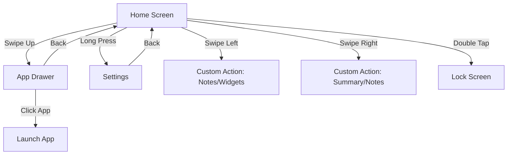

<p align="center">
  
</p>

<h1 align="center">VOID</h1>

<p align="center">
  <em>A radically minimalist, high-performance Android launcher designed to combat digital addiction.</em>
</p>

<p align="center">
  
  
  
  
  
  
</p>

---

## 🌑 Philosophy

**VOID** is built on the principle of intentionality. By stripping away colorful icons, notification badges, and complex grid layouts, VOID eliminates the psychological triggers that lead to mindless scrolling. It provides a hyper-clean, text-based interface where you are in control of your phone, not the other way around.

---

## ✨ Core Features

- **Text-Only Home Screen**: Pin up to 10 of your most essential apps as clean text labels. No icons, no distractions.
- **Smart Notification Grouping**: A dedicated screen that groups system notifications by app with smart summaries, categorized by conversation.
- **On-Device AI Summarization**: Uses Gemini Nano (via ML Kit) to summarize your notifications locally, ensuring privacy and speed.
- **Integrated Quick Notes**: Fast, text-based checklist for capturing thoughts instantly with priority ordering and reminders.
- **Deep Android 15 Integration**: Full support for Private Space, allowing you to access hidden and secure apps directly from the drawer.
- **Digital Wellbeing**: Screen time and unlock counts are integrated directly into the home screen for at-a-glance awareness.
- **Fluid Gestures**: Swipe up for apps, swipe down for the in-app notification list (toggle in Settings), and custom left/right actions.
- **Modern UI**: Built with 100% Jetpack Compose and Material 3. Bundled sans fonts (Google Sans default, Inter, Plus Jakarta Sans, Manrope, DM Sans) apply through `VoidAppTheme`.
- **Searchable settings**: Grouped Look / Home / App library / Gestures & motion / Features / Permissions, with animation speed and content swipe-to-back.

---

## 📱 Screen Flow & Navigation

Navigate your device with a simple, gesture-based mental model:



---

## 🛠 Technical Architecture

VOID Launcher leverages the latest Android development stack for maximum performance and a minimal footprint.

- **UI Framework**: [Jetpack Compose](https://developer.android.com/compose) with [Material 3](https://m3.material.io/).
- **Programming Language**: 100% Kotlin.
- **State Management**: Clean Architecture with Fragments/Single-Activity and shared `MainViewModel` using Kotlin Coroutines and Flow.
- **Intelligence**: Integrated with **ML Kit GenAI** for on-device notification processing.
- **Background Tasks**: Powered by `WorkManager` for reliable, low-impact operations like wallpaper updates.
- **Persistence**: Hybrid approach using `SharedPreferences` and JSON for lightweight, fast data access.

---

## 🚀 Getting Started

### Prerequisites
- **Android Studio Koala** (or newer)
- **JDK 17** or **JDK 21**
- **Android SDK Platform 36**

### Building from Source

```bash
# Clone the repository
git clone https://github.com/knownassurajit/void.git
cd void

# Single-variant open-source build (full features)
./gradlew clean assembleDebug
./gradlew assembleRelease
./gradlew bundleRelease
```

Output APKs land under `build/outputs/apk/debug/` or `build/outputs/apk/release/`.

### Testing

```bash
./gradlew testDebugUnitTest
./gradlew lintDebug
# with a device/emulator:
./gradlew connectedDebugAndroidTest
```

See [`docs/`](docs/) for architecture, features, settings, testing guides, and bug fix notes.

> **Note:** The former `integrated` / `disintegrated` product flavors were removed. VOID ships as one OSS build with runtime capability gates. See [`docs/architecture/flavor-decision.md`](docs/architecture/flavor-decision.md).

---

## 🔄 CI/CD

Three workflows cover the branch pipeline, each scoped to a single concern:

| File | Trigger | Purpose |
|---|---|---|
| `.github/workflows/ci-cd.yml` | push to `develop`/`master`, PRs targeting `master` | develop/master pipeline (see below) |
| `.github/workflows/stage.yml` | push to `stage` | debug build → GitHub pre-release (unchanged, split out verbatim from the old `build.yml`) |

**`ci-cd.yml` jobs:**
- **`test`** — `testDebugUnitTest` + `lintDebug`, containerized (`eclipse-temurin:17-jdk-jammy`). Runs on every push to `develop`/`master` and on every pull request targeting `master`.
- **`debug-release`** (push to `develop` only, needs `test`) — re-runs tests/lint, then builds and uploads a debug APK as a GitHub pre-release tagged `develop-v$version-$run_number`.
- **`pr-summary`** (pull requests targeting `master`, needs `test`) — re-runs checks and posts a `$GITHUB_STEP_SUMMARY` plus a sticky PR comment with test/lint results and a changelog preview since the last stable release tag.
- **`stable-release`** (push to `master` only, needs `test`) — **the single release path**: unit tests + lint, `assembleRelease` + `bundleRelease`, signs via `r0adkll/sign-android-release@v1` (the only signing step — no unused keystore-decode step), renames to `void-release-v$version.{apk,aab}`, creates/pushes a `release/void/$version` branch for rollback tracking, publishes a GitHub stable release tagged `v$version`, and optionally publishes to the Google Play internal track.

Jobs run inside `container: image: eclipse-temurin:17-jdk-jammy`; each job installs `unzip`/`curl`/`git` via `apt-get` and sets up the Android SDK with `android-actions/setup-android@v3` before invoking Gradle.

**Google Play publishing** is gated on `secrets.PLAY_CONSOLE_JSON` being present. This fixes a bug in the old `play-release.yml`, which gated on `env.PLAY_CONSOLE_JSON != ''` — an env var that was never actually set before that condition was evaluated, making the gate either a permanent no-op or (if evaluated differently) capable of firing an unintended production Play publish on every push to `develop`. The fixed workflow resolves the secret in an earlier `play_console_check` step (a step's own `env:` is visible to its `run:`, just not to its own `if:`) and downstream steps gate on that step's output, so the Play publish step is a safe no-op with no `PLAY_CONSOLE_JSON` secret configured, and only runs on push to `master` when it is.

Required secrets for `stable-release`: `SIGNING_KEY`, `ALIAS`, `KEY_STORE_PASSWORD`, `KEY_PASSWORD` (APK/AAB signing, required), `PLAY_CONSOLE_JSON` (optional — enables Play Console publish).

---

## 🛡 Privacy & Security

VOID is designed with privacy as a first-class citizen:
- **No Ads. No Tracking.**
- **Local AI**: All summarization happens on-device using Gemini Nano. Your data never leaves your phone.
- **Open Source**: The code is fully transparent and open for audit.

---

## 📄 License & Credits

VOID is a heavily restructured and modernized fork of **Olauncher**. We credit the original project for the foundational concept of a minimalist, text-based launcher.

- **License**: This project is licensed under the [GNU General Public License v3.0](https://www.gnu.org/licenses/gpl-3.0.en.html).
- **Original Base**: [Olauncher](https://github.com/tanujnotes/olauncher) by Tanuj.
- **Typography**: Inter (RSMS) and Google Sans.
- **Icons**: Material Symbols (Google).

---

<p align="center">
  <em>“Are you using your phone, or is your phone using you?”</em>
</p>
